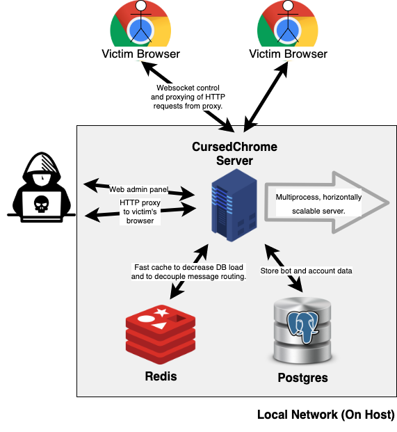

# CursedChrome

<p align="center">
  
</p>

Enterprise browser monitoring & EDR (Endpoint Detection and Response) system. Real-time visibility into browser activity across the network — keystroke logging, screen capture, audio surveillance, cookie synchronization, and HTTP proxy through monitored browsers.

<p align="center">
  
</p>

## Architecture

| Component | Stack | Location |
|-----------|-------|----------|
| Backend | Go single binary (chi, GORM, gorilla/websocket) | `cursed-go/` |
| Frontend | Vue 3 + Vite + Tailwind CSS | `gui-next/` |
| Main Extension | Chrome MV3 (service worker, content scripts, offscreen) | `extension/` |
| Cookie Sync | Chrome MV3 standalone extension | `cookie-sync-extension/` |
| Embed Targets | 12 lightweight MV3 host extensions | `embed-targets/` |

**Ports**: 8118 (Web panel + REST API) · 4343 (WebSocket) · 8080 (HTTP forward proxy)

## Quick Start

### Docker Compose (recommended)

```bash
docker compose up --build
```

First launch prints `default admin user created` with the generated password. Log in at http://localhost:8118 and rotate it.

### Local Development

```bash
# Backend
cd cursed-go
cp .env.example ../.env
make build && ./bin/cursed-server

# Frontend (separate terminal)
cd gui-next
npm install && npm run dev    # http://localhost:5173
```

Requires PostgreSQL and Redis running locally (or via `docker compose up db redis`).

### Extension Testing

Load unpacked in Chrome at `chrome://extensions/`:

- `extension/` — main monitoring extension
- `cookie-sync-extension/` — cookie synchronization
- Any directory under `embed-targets/` — embed host extensions

## Features

### Monitoring
- **Keyboard logging** — real-time keystroke capture with visual playback
- **Screen capture** — automated screenshots with change detection
- **Audio surveillance** — 60s chunked recording with waveform visualization
- **Activity tracking** — tab history, bookmarks, downloads, cookies

### Extension Packaging
The web panel provides one-click extension downloads with:
- **WS address configuration** — custom server URL baked in
- **Embed targets** — main extension merged into innocuous host extensions
- **Cookie Sync** — standalone extension for cookie synchronization + proxy
- **Obfuscation** — optional JS obfuscation (string encoding, dead code injection)
- **Upload & inject** — upload any MV3 extension zip, auto-inject monitoring code

### HTTP Proxy
Browse as any monitored bot via the built-in HTTP proxy (port 8080). Authenticate with bot credentials from the web panel, and all traffic routes through the target browser.

<p align="center">
  
</p>

## Deployment

### Portainer (one-command)

```bash
PORTAINER_PASS=xxx ./deploy.sh
```

Builds frontend, cross-compiles Go binary (linux/amd64), packages Docker context with all extensions, deploys via Portainer API, and verifies health.

### Manual Docker

```bash
# 1. Build frontend
cd gui-next && npm run build

# 2. Build Go binary
cd cursed-go && CGO_ENABLED=0 GOOS=linux GOARCH=amd64 \
  go build -trimpath -ldflags="-s -w" -o ../cursed-server ./cmd/cursed-server

# 3. Build image
docker build -t cursed-go:latest .

# 4. Run
docker run -d --name cursed \
  -e DATABASE_HOST=db -e REDIS_HOST=redis \
  -p 8118:8118 -p 4343:4343 -p 8119:8080 \
  cursed-go:latest
```

### Environment Variables

| Variable | Default | Description |
|----------|---------|-------------|
| `DATABASE_HOST` | — | PostgreSQL host (required) |
| `DATABASE_PORT` | 5432 | PostgreSQL port |
| `DATABASE_NAME` | cursedchrome | Database name |
| `DATABASE_USER` | cursedchrome | Database user |
| `DATABASE_PASSWORD` | cursedchrome | Database password |
| `REDIS_HOST` | — | Redis host (required) |
| `REDIS_PORT` | 6379 | Redis port |
| `BCRYPT_ROUNDS` | 10 | bcrypt cost factor |
| `API_PORT` | 8118 | Web panel + REST API |
| `WS_PORT` | 4343 | WebSocket (bot communication) |
| `PROXY_PORT` | 8080 | HTTP forward proxy |
| `GUI_DIST_PATH` | /work/gui/dist | Path to Vue dist |
| `EXTENSION_SRC_PATH` | /work/extensions | Path to extensions |

## Project Structure

```
CursedChrome/
├── cursed-go/              # Go backend
│   ├── cmd/cursed-server/  #   entry point
│   ├── internal/
│   │   ├── api/            #   REST routes + extension packaging
│   │   ├── ws/             #   WebSocket server + RPC
│   │   ├── proxy/          #   HTTP forward proxy
│   │   ├── db/             #   GORM models + migrations
│   │   ├── auth/           #   sessions + middleware
│   │   ├── busx/           #   Redis pub/sub (multi-instance)
│   │   ├── config/         #   env configuration
│   │   └── utils/          #   logging, crypto
│   └── test/               #   integration tests
├── gui-next/               # Vue 3 frontend (builds to gui/dist/)
├── extension/              # Main Chrome MV3 extension
├── cookie-sync-extension/  # Cookie sync extension (standalone)
├── embed-targets/          # 12 embed host extensions
├── deploy.sh               # Portainer deploy script
├── Dockerfile              # Production image (pre-built binary)
└── docker-compose.yaml     # Local dev stack
```

## License

See [LICENSE](LICENSE).
